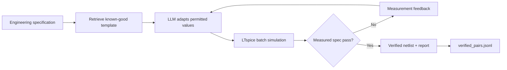

# Spice Wizard

> **Generate less. Verify more.**
>
> Spice Wizard adapts known-good LTspice application-circuit templates to a numerical design specification, then proves the result with a real LTspice simulation before presenting it as a pass.

Spice Wizard is an analog-design assistant built for the AMD Developer Hackathon. It combines a retrievable corpus of LTspice templates with an LLM backend and a simulator-in-the-loop verification gate.



## Why it matters

An LLM can make a textbook-correct resistor change and still produce a physically invalid circuit. Spice Wizard uses the simulator as ground truth:

- **Template retrieval:** 4,032 curated `.net` templates are indexed locally.
- **Constrained adaptation:** generated candidates must preserve subcircuit calls, library directives, and simulation analyses.
- **Real verification:** LTspice waveform data is measured for gain and bandwidth, then compared against numeric targets.
- **Retry feedback:** failed measurements can be returned to an OpenAI-compatible LLM backend for another attempt.
- **Verified data flywheel:** passing `(spec, netlist, report)` records are appended to `data/verified_pairs.jsonl`.

## Verified examples

| Case | Result |
|---|---:|
| Stock AD8092 gain check | **6.014 dB** measured vs 6.0 dB target |
| AD811 pulse-testbench gain check | **6.461 dB** measured vs 6.02 dB target |
| Gain-5 AD8092 candidate under a sane stimulus | **13.952 dB** measured vs 13.98 dB target |
| Intentional 1 V, 10 MHz slew-rate case | **~10.305 dB**, correctly rejected against a 13.98 dB target |

See [docs/TEST_RESULTS.md](docs/TEST_RESULTS.md) for the validated test record.

## Repository layout

```text
Spice_Wizard/
├── app/                    # Tkinter GUI, LTspice runner, local-agent integration
├── data/
│   ├── templates/          # 4,032 LTspice template netlists only
│   └── verified_pairs.jsonl
├── docs/                   # Architecture, AMD deployment, test evidence
├── models/gemma3-lora/     # Optional LoRA adapter tracked through Git LFS
├── notebooks/              # AMD MI300X Qwen serving notebook
├── training/               # Optional dataset preparation and fine-tuning source
├── generate_verify.py      # Retrieve → generate → verify → retry CLI
├── report_netlist.py       # Direct netlist specification verifier CLI
├── sim_harness.py          # Common LTspice verification interface
└── requirements.txt        # Portable runtime dependencies
```

## Prerequisites

- Python 3.10–3.13
- [LTspice](https://www.analog.com/en/resources/design-tools-and-calculators/ltspice-simulator.html)
- Git and Git LFS
- An OpenAI-compatible backend only when using automatic generation/retry
  - OpenRouter, or
  - Qwen on an AMD MI300X via the notebook in `notebooks/`

## Installation

### 1. Clone and retrieve the adapter

```bash
git clone https://github.com/<YOUR_GITHUB_USERNAME>/Spice_Wizard.git
cd Spice_Wizard
git lfs install
git lfs pull
```

`git lfs pull` retrieves the optional local Gemma LoRA adapter. The verifier and manual AMD-Qwen flow work without loading that model.

### 2. Create a Python environment

```bash
python3 -m venv .venv
source .venv/bin/activate
python -m pip install --upgrade pip
python -m pip install -r requirements.txt
```

On AMD ROCm systems, install the ROCm-compatible PyTorch build supplied by the AMD environment before installing the remaining packages.

### 3. Configure optional LLM access

```bash
cp .env.example .env
```

Edit `.env` only on your machine. Never commit it. For OpenRouter, set `OPENROUTER_API_KEY`. For AMD Qwen, set `LLM_BASE_URL`, `LLM_API_KEY`, and `LLM_MODEL` as described in [docs/AMD_DEPLOYMENT.md](docs/AMD_DEPLOYMENT.md).

## Quick use

### Verify a known template in LTspice

```bash
python report_netlist.py data/templates/AD8092.net \
  --metric gain_db=6.0:1.0
```

Expected result: approximately 6.014 dB and `PASS`.

### Launch the GUI

```bash
python app/run_gui.py
```

The editor, simulation, waveform plotting, and **Verify Spec** tab work without a local model. To opt in to the local Gemma agent after installing the LoRA adapter and base model prerequisites:

```bash
SPICE_WIZARD_ENABLE_LOCAL_AGENT=1 python app/run_gui.py
```

### Verify a manually generated AMD-Qwen candidate

Export a constrained prompt locally:

```bash
python generate_verify.py AD8092 \
  --spec "non-inverting gain of 5 V/V, +/-5 V supplies, 100 mV at 1 MHz" \
  --prompt-only > /tmp/ad8092_prompt.txt
```

Paste the prompt into Qwen running on the MI300X. Save its full response as `/tmp/qwen_candidate.txt`, then verify it locally:

```bash
python generate_verify.py AD8092 \
  --spec "non-inverting gain of 5 V/V, +/-5 V supplies, 100 mV at 1 MHz" \
  --metric gain_db=13.98:1.0 \
  --freq 1e6 \
  --candidate /tmp/qwen_candidate.txt \
  --source amd_mi300x_manual
```

A passing candidate is written to `data/verified_pairs.jsonl` with its source label.

## AMD MI300X deployment

The AMD path is intentionally two-step and demo-friendly:

1. Run [notebooks/amd_serve_qwen.ipynb](notebooks/amd_serve_qwen.ipynb) on the MI300X.
2. Use Qwen to adapt a retrieved template.
3. Bring the Qwen response to this repository.
4. Run real LTspice verification on the Mac.
5. Capture `rocm-smi` during inference as AMD-compute evidence.

Full setup and recording guidance is in [docs/AMD_DEPLOYMENT.md](docs/AMD_DEPLOYMENT.md).

## Optional local LoRA adapter

`models/gemma3-lora/adapter_model.safetensors` is an adapter, not a complete foundation model. It is tracked with Git LFS and requires the compatible Gemma base model declared in its adapter configuration at runtime. See [models/gemma3-lora/README.md](models/gemma3-lora/README.md).

## Tests and evidence

- [docs/TEST_RESULTS.md](docs/TEST_RESULTS.md) — observed verification results
- [docs/TESTING_PLAN.md](docs/TESTING_PLAN.md) — pre-submission test checklist
- [docs/ARCHITECTURE.md](docs/ARCHITECTURE.md) — component responsibilities

## Scope and limitations

- The system adapts **known-good templates**; it does not claim unrestricted analog topology synthesis.
- The current verifier measures gain and bandwidth where the selected LTspice analysis supports them.
- LTspice must be installed locally and its library files must be available.
- Template-netlist provenance and redistribution permissions must be reviewed before any public release beyond this hackathon repository.

## Security

- Keep `.env` private.
- Do not paste API keys into notebooks, screenshots, terminal recordings, or commits.
- Rotate any key that was ever exposed outside a secure secret store.
