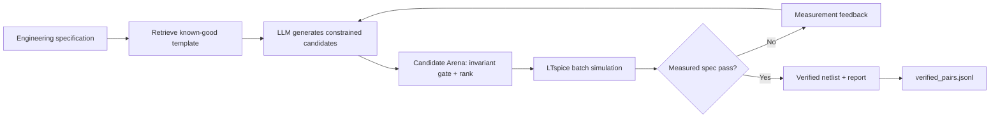

# Spice Wizard

> **Generate less. Verify more.**
>
> Spice Wizard adapts known-good LTspice application-circuit templates to a numerical design specification, then proves the result with a real LTspice simulation before presenting it as a pass.

Spice Wizard is an analog-design assistant built for the AMD Developer Hackathon. It combines a retrievable corpus of LTspice templates with an LLM backend and a simulator-in-the-loop verification gate.



## AMD compute usage

| What | Where | Status |
|---|---|---|
| Netlist generation & adaptation — Qwen3 (open weights) | **AMD Instinct MI300X**, PyTorch on **ROCm**, fp16 | ✅ working |
| Live OpenAI-compatible endpoint served from the MI300X | [notebooks/amd_serve_and_tunnel.ipynb](notebooks/amd_serve_and_tunnel.ipynb) — token-protected FastAPI + HTTPS/443 tunnel | ✅ working |
| MI300X inference proof (`rocm-smi` under load) | [notebooks/amd_mi300x_demo.ipynb](notebooks/amd_mi300x_demo.ipynb) | ✅ working |
| Manual best-of-N handoff (works even without a tunnel) | [docs/AMD_DEPLOYMENT.md](docs/AMD_DEPLOYMENT.md) + Candidate Arena | ✅ working |
| Backend swap OpenRouter ↔ MI300X | `.env` only: `LLM_BASE_URL`, `LLM_API_KEY`, `LLM_MODEL` — zero code changes | ✅ working |
| vLLM serving + RSFT fine-tuning on verified pairs | same MI300X | 🔜 roadmap |

**Division of labor:** the MI300X runs all LLM inference; the workstation runs
LTspice (CPU EDA) as the physics gatekeeper. AI on AMD, physics in SPICE.

## Why it matters

An LLM can make a textbook-correct resistor change and still produce a physically invalid circuit. Spice Wizard uses the simulator as ground truth:

- **Template retrieval:** 4,032 curated `.net` templates are indexed locally.
- **Constrained adaptation:** generated candidates must preserve subcircuit calls, library directives, and simulation analyses.
- **Real verification:** LTspice waveform data is measured for gain and bandwidth, then compared against numeric targets.
- **Retry feedback:** failed measurements can be returned to an OpenAI-compatible LLM backend for another attempt.
- **Candidate Arena:** several AMD or local model outputs can compete under one template guard and the same measured specification.
- **Verified data flywheel:** passing `(spec, netlist, report)` records are appended to `data/verified_pairs.jsonl`.

## Verified examples

| Case | Result |
|---|---:|
| Stock AD8092 gain check | **6.014 dB** measured vs 6.0 dB target |
| AD811 pulse-testbench gain check | **6.461 dB** measured vs 6.02 dB target |
| Gain-5 AD8092 candidate under a sane stimulus | **13.952 dB** measured vs 13.98 dB target |
| Intentional 1 V, 10 MHz slew-rate case | **~10.305 dB**, correctly rejected against a 13.98 dB target |

See [docs/TEST_RESULTS.md](docs/TEST_RESULTS.md) for the validated test record.

## Repository layout

```text
Spice_Wizard/
├── app/                    # Tkinter GUI, LTspice runner, local-agent integration
├── data/
│   ├── templates/          # 4,032 LTspice template netlists only
│   └── verified_pairs.jsonl
├── docs/                   # Architecture, AMD deployment, test evidence
├── models/gemma3-lora/     # Optional LoRA adapter tracked through Git LFS
├── netgen/                 # UC3 scaffolding: signal-chain synthesis + RSFT data prep
├── notebooks/              # MI300X serving, live tunnel, and rocm-smi proof notebooks
├── tests/                  # Candidate Arena unit tests (pytest)
├── training/               # Optional dataset preparation and fine-tuning source
├── candidate_arena.py       # Best-of-N candidate ranking and evidence export
├── generate_verify.py      # Retrieve → generate → verify → retry CLI
├── report_netlist.py       # Direct netlist specification verifier CLI
├── sim_harness.py          # Common LTspice verification interface
└── requirements.txt        # Portable runtime dependencies
```

## Prerequisites

- Python 3.10–3.13
- [LTspice](https://www.analog.com/en/resources/design-tools-and-calculators/ltspice-simulator.html)
- Git and Git LFS
- An OpenAI-compatible backend only when using automatic generation/retry
  - OpenRouter, or
  - Qwen on an AMD MI300X via the notebook in `notebooks/`

## Installation

### 1. Clone and retrieve the adapter

```bash
git clone https://github.com/Aakash356A/Spice_Wizard.git
cd Spice_Wizard
git lfs install
git lfs pull
```

`git lfs pull` retrieves the optional local Gemma LoRA adapter. The verifier and manual AMD-Qwen flow work without loading that model.

### 2. Create a Python environment

```bash
python3 -m venv .venv
source .venv/bin/activate
python -m pip install --upgrade pip
python -m pip install -r requirements.txt
```

On AMD ROCm systems, install the ROCm-compatible PyTorch build supplied by the AMD environment before installing the remaining packages.

### 3. Configure optional LLM access

```bash
cp .env.example .env
```

Edit `.env` only on your machine. Never commit it. For OpenRouter, set `OPENROUTER_API_KEY`. For AMD Qwen, set `LLM_BASE_URL`, `LLM_API_KEY`, and `LLM_MODEL` as described in [docs/AMD_DEPLOYMENT.md](docs/AMD_DEPLOYMENT.md).

## Quick use

### Verify a known template in LTspice

```bash
python report_netlist.py data/templates/AD8092.net \
  --metric gain_db=6.0:1.0
```

Expected result: approximately 6.014 dB and `PASS`.

### Launch the GUI

```bash
python app/run_gui.py
```

The editor, simulation, waveform plotting, and **Verify Spec** tab work without a local model. The chat agent activates when an LLM backend is configured in `.env` — the AMD MI300X endpoint (see [notebooks/amd_serve_and_tunnel.ipynb](notebooks/amd_serve_and_tunnel.ipynb)) or OpenRouter. To additionally opt in to the local Gemma specialist after installing the LoRA adapter and base model prerequisites:

```bash
SPICE_WIZARD_ENABLE_LOCAL_AGENT=1 python app/run_gui.py
```

### Verify a manually generated AMD-Qwen candidate

Export a constrained prompt locally:

```bash
python generate_verify.py AD8092 \
  --spec "non-inverting gain of 5 V/V, +/-5 V supplies, 100 mV at 1 MHz" \
  --prompt-only > /tmp/ad8092_prompt.txt
```

Paste the prompt into Qwen running on the MI300X. Save its full response as `/tmp/qwen_candidate.txt`, then verify it locally:

```bash
python generate_verify.py AD8092 \
  --spec "non-inverting gain of 5 V/V, +/-5 V supplies, 100 mV at 1 MHz" \
  --metric gain_db=13.98:1.0 \
  --freq 1e6 \
  --candidate /tmp/qwen_candidate.txt \
  --source amd_mi300x_manual
```

A passing candidate is written to `data/verified_pairs.jsonl` with its source label.

### Select the best of several AMD-Qwen candidates

Generate several independent, constrained responses on the MI300X and save each
full response locally. The **Candidate Arena** applies the same topology and
testbench guard to every candidate, runs real LTspice verification, ranks the
results, logs every passing candidate, and exports a portable evidence bundle.

```bash
python generate_verify.py AD8092 \
  --spec "non-inverting gain of 5 V/V, +/-5 V supplies, 100 mV at 1 MHz" \
  --metric gain_db=13.98:1.0 \
  --freq 1e6 \
  --candidates /tmp/qwen_candidate_*.txt \
  --source amd_mi300x_manual \
  --report /tmp/ad8092_candidate_arena.json \
  --save /tmp/ad8092_best.net
```

The JSON evidence bundle includes the trusted-template hash, each candidate
hash, provenance label, measured metrics, pass/fail status, rank, and timing.
`PASS` remains the acceptance gate; the quality score only orders candidates
that have already been measured under the same specification.

The GUI exposes the same flow in **Verify Spec → Candidate Arena**: load the
trusted template, add metrics, import model responses, select the measured
winner, and export the evidence JSON for a demo or review.

## AMD MI300X deployment

Two supported paths — both keep the acceptance decision local and reproducible:

**A. Live endpoint (recommended):** run
[notebooks/amd_serve_and_tunnel.ipynb](notebooks/amd_serve_and_tunnel.ipynb) on
the MI300X. It serves a token-protected OpenAI-compatible endpoint through an
HTTPS/443 tunnel and prints the three `LLM_*` values for `.env`. The GUI chat,
`generate_verify.py`, and the Candidate Arena then run against AMD hardware
live.

**B. Manual handoff (no tunnel needed):**

1. Run [notebooks/amd_serve_qwen.ipynb](notebooks/amd_serve_qwen.ipynb) on the MI300X.
2. Use Qwen to generate one or more constrained adaptations of a retrieved template.
3. Bring the Qwen responses to this repository.
4. Use Candidate Arena to choose the best real-SPICE result on the Mac.
5. Capture `rocm-smi` during inference as AMD-compute evidence.

Full setup and recording guidance is in [docs/AMD_DEPLOYMENT.md](docs/AMD_DEPLOYMENT.md).

## Optional local LoRA adapter

`models/gemma3-lora/adapter_model.safetensors` is an adapter, not a complete foundation model. It is tracked with Git LFS and requires the compatible Gemma base model declared in its adapter configuration at runtime. See [models/gemma3-lora/README.md](models/gemma3-lora/README.md).

## Main code path (for reviewers)

1. [template_index.py](template_index.py) — resolves the requested part to a
   curated template in `data/templates/` (4,032 netlists).
2. [llm_client.py](llm_client.py) — the single OpenAI-compatible `call_llm()`
   used by every backend; the AMD MI300X endpoint is selected purely by
   `LLM_BASE_URL`.
3. [candidate_arena.py](candidate_arena.py) — template-invariant validation,
   best-of-N ranking, and evidence-bundle export.
4. [sim_harness.py](sim_harness.py) — LTspice batch execution and `.raw`
   waveform measurement.
5. [generate_verify.py](generate_verify.py) — the CLI that orchestrates
   retrieve → adapt (AMD) → verify (LTspice) → retry, for a single candidate or
   a candidate set.
6. [app/gui_main.py](app/gui_main.py) — the same flow in the GUI (Verify Spec
   and Candidate Arena panels, chat agent).

## External services

| Service | Used for | Required? |
|---|---|---|
| AMD cloud MI300X (ROCm) | All LLM generation in the primary flow | Yes, for generation |
| Cloudflare quick tunnel | HTTPS/443 path from the workstation to the MI300X endpoint | Optional — manual handoff works without it |
| Hugging Face Hub | Qwen2.5-Coder open-weights download on the MI300X | First run only |
| OpenRouter | Optional non-AMD backend for development | Optional |
| LTspice (local install) | Ground-truth simulation and verification | Yes |

## Tests and evidence

- [docs/TEST_RESULTS.md](docs/TEST_RESULTS.md) — observed verification results
- [docs/TESTING_PLAN.md](docs/TESTING_PLAN.md) — pre-submission test checklist
- [docs/ARCHITECTURE.md](docs/ARCHITECTURE.md) — component responsibilities

## Scope and limitations

- The system adapts **known-good templates**; it does not claim unrestricted analog topology synthesis.
- The current verifier measures gain and bandwidth where the selected LTspice analysis supports them.
- LTspice must be installed locally and its library files must be available.
- Template-netlist provenance and redistribution permissions must be reviewed before any public release beyond this hackathon repository.

## Security

- Keep `.env` private.
- Do not paste API keys into notebooks, screenshots, terminal recordings, or commits.
- Rotate any key that was ever exposed outside a secure secret store.
