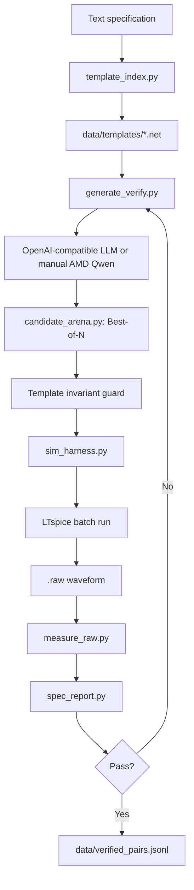

# Architecture

## Product boundary

Spice Wizard is a **template adaptation and verification system**. It begins with a known LTspice application circuit, permits only bounded edits, and uses LTspice results as the acceptance criterion.

## Runtime components

| Component | Responsibility |
|---|---|
| `template_index.py` | Finds a canonical template for a requested IC. |
| `generate_verify.py` | Builds constrained prompts, verifies candidates, applies retry feedback, and writes verified records. |
| `candidate_arena.py` | Applies one trusted template/spec context to multiple candidates, ranks simulator-backed outcomes, and exports JSON evidence bundles. |
| `llm_client.py` | Calls a configurable OpenAI-compatible endpoint. |
| `sim_harness.py` | Provides the common text-netlist-to-`SimResult` interface. |
| `app/simulation_runner.py` | Locates LTspice and normalizes library paths across platforms. |
| `measure_raw.py` | Measures AC gain, bandwidth, or transient gain from LTspice raw data. |
| `spec_report.py` | Produces target, measured value, margin, and PASS/FAIL/N/A report rows. |
| `app/gui_main.py` | Tkinter editor, simulation, plotting, Verify Spec, and optional agent UI. |

## Safety constraints

Before simulation, `validate_template_constraints()` rejects a candidate that changes any of these template invariants:

- element identifiers, order, or node connectivity;
- subcircuit-call lines;
- `.lib`, `.include`, or `.model` directives;
- `.ac`, `.dc`, `.op`, or `.tran` analysis directives.

The generator may change R/C/L value tokens and V/I source waveform/value arguments, not the known-good topology or testbench structure.

## Backends

### Default local verification

The verifier runs LTspice locally. It does not require an LLM or a network connection.

### Generic LLM API

`llm_client.py` uses `LLM_BASE_URL`, `LLM_API_KEY`, and `LLM_MODEL`. OpenRouter is the default compatibility path.

### AMD MI300X manual handoff

The notebook runs Qwen on AMD hardware. The generated text is brought back to the Mac and passed to `generate_verify.py --candidate`, ensuring that the local simulator remains the final authority.

For a best-of-$N$ AMD demonstration, Qwen generates $N$ independent responses
and `generate_verify.py --candidates ... --report evidence.json` sends each
through the same local Candidate Arena. The rank is only a selection aid: every
candidate must still pass the real LTspice specification gate.

## Optional local Gemma adapter

The bundled LoRA adapter is not required for the verifier. It is an optional local-specialist experiment and requires a compatible base model plus the `SPICE_WIZARD_ENABLE_LOCAL_AGENT=1` opt-in when launching the GUI.
